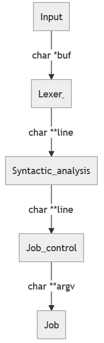

# Minishell [](i.imgur.com/9NXfcit.jpg)
[](https://travis-ci.com/Ant0wan/Minishell)

An implementation of some a simple start of a **shellscript** [a 42 project].

This project aims to get familiar with some of the core of the Unix system and explore an important part of the system’s API: process creation and synchronisation.

## Description


## General Architecture

Minishell is organized in modules.

## Workflow

The following is the main steps of the minishell workflow:

- Input Stream

- Lexical Analysis

- Parsing

- Job control

- Job execution

After the input stream has been capture by the `Input module`, a raw string is passed to the `Lexer module` for lexical analysis. Then the tokenization process takes place.

Once the tokens created and subsitution of expansions done, the lexer send a table of pointer - containing the tokens - to the `Syntactic Module` for parsing. The parsing only checks unfitting/unrecognized tokens.

Once the syntactic analysis done the parser send the validated table of pointers to the `Job Control Module`. The job control then create sequences that are being executed by the `Job Module` in sequence.

Input sample : `ls -l -- file repo ; echo $? ; env -i ls ; coco ";s;s'"`

Fom the sample input, the first sequence executed by job would be `ls -l -- file repo`, the second sequence `echo $?` the third sequence `env -i ls`, then the last sequences `coco`, `s`, `s'"``

Unfortunately Minishell input does not recognized parenthethis nor brackets nor quotes as bash does.

Illustration of the above-explained workflow:



## Usage

- Clone project repository

```shell=
git clone --recurse-submodules https://github.com/Ant0wan/Minishell.git
```

- Build project

```shell=
cd Minishell && make -j
```

- Run `minishell`

```shell=
./minishell
```

